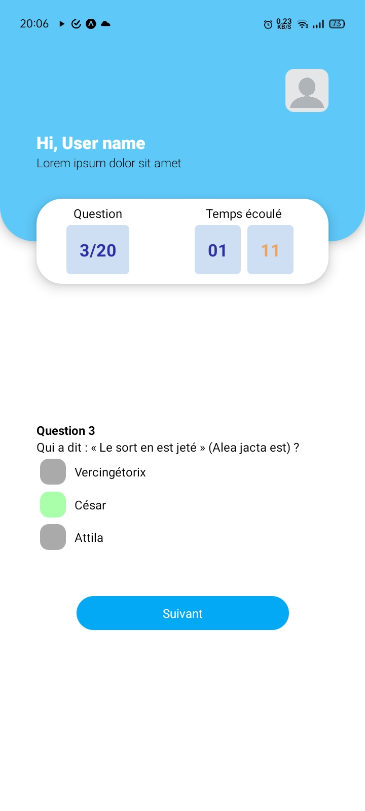

# React Native test for ALIKAR Morocco.

This test was realized in a couple of hours using React Native.
Although small in it's size, the design was focused on scalability, the code is already organized and devided in a similar way to much bigger projects.

The only external library used is Zustand to manage global React states.

# Test React Native pour ALIKAR Maroc.

Ce test a été réalisé en quelques heures avec React Native.
Bien que de petite taille, la conception était axée sur l'évolutivité, le code est déjà organisé et divisé de la même manière que pour des projets beaucoup plus importants.

La seule bibliothèque externe utilisée est Zustand pour gérer les états React globaux.

## Screenshots:

