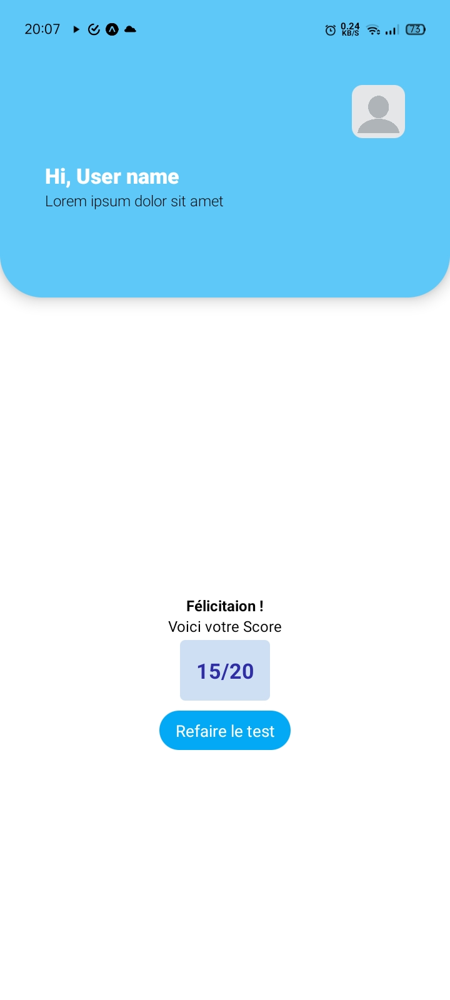

# React Native test for ALIKAR Morocco.

This test was realized in a couple of hours using React Native.
Although small in it's size, the design was focused on scalability, the code is already organized and devided in a similar way to much bigger projects.

The only external library used is Zustand to manage global React states.

### If you want to see the progression up to the 24 hours deadline, refer to commit [d509495](https://github.com/Izoomii/ReactNativeTest/tree/d509495031ca2b467657d134b4af5064a879df84).

# Test React Native pour ALIKAR Maroc.

Ce test a été réalisé en quelques heures avec React Native.
Bien que de petite taille, la conception était axée sur l'évolutivité, le code est déjà organisé et divisé de la même manière que pour des projets beaucoup plus importants.

La seule bibliothèque externe utilisée est Zustand pour gérer les états React globaux.

### Si vous souhaitez voir la progression jusqu'au délai de 24 heures, reportez-vous au commit [d509495](https://github.com/Izoomii/ReactNativeTest/tree/d509495031ca2b467657d134b4af5064a879df84).

## Screenshots:

